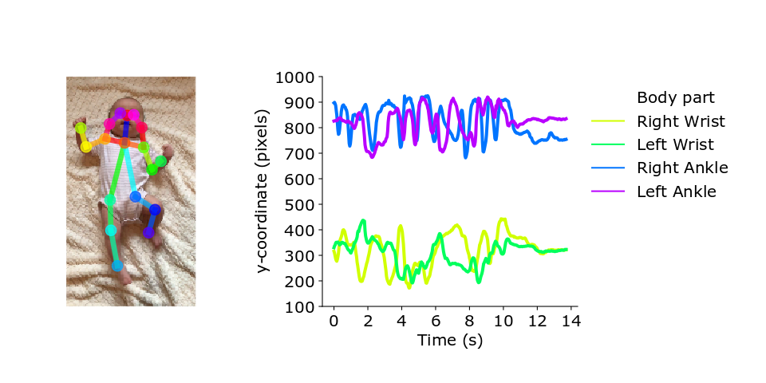

# Infant pose estimation and infant movement-based assessment

  

## Project Contributors
Claire Chambers clairenc@seas.upenn.edu   
Nidhi Seethapathi snidhi@seas.upenn.edu  
Rachit Saluja rsaluja@seas.upenn.edu  
Laura Prosser prosserl@email.chop.edu  
Michelle Johnson johnmic@pennmedicine.upenn.edu  
Konrad Kording kording@seas.upenn.edu  

Directory structure
------------

    ├── README.md  
    ├── data (Download [here] (https://figshare.com/s/))  
    │   ├── example_video  
    │   ├── interim  
    │   ├── pose_estimates  
    │   ├── pose_model  
    │   ├── processed  
    │   ├── video_meta_data  
    │   └── visualization  
    ├──models (Download [here] (https://figshare.com/s/))  
    ├── notebooks  
    ├──src  
    │   ├──  data  
    │   ├──  modules  
    │   ├──  pose_model  
    │   └──  visualization 

--------

## Motivation
Infant movement-based assessments identify infants at risk for neuromotor diseases. Existing tests are based on visual inspection of infant movement by clinicians and are not widely available. Population screening would identify a greater number of at-risk infants. To do population screening, we need automated tests.

## Objectives
Our objective is to provide methods to automate movement-based assessments for infants using video analysis of infant movement.
We provide:
- A pose estimation model trained to extract infant pose from videos
- A pipeline to retrain a neural network using ground-truth pose data
- A pipeline to extract pose from videos, and statistically compares at-risk infants to a normative database of infant movement
- A normative database of infant movement
- Movement data from at-risk infants

## Data
To create a normative database of healthy infant movement, we collected video data of infants on YouTube (video URLs and  infant pose data [here](https://figshare.com/s/10034c230ad9b2b2a6a4)). To validate our approach, we recorded infants at different levels of neuromotor risk collected in the laboratory (infant pose data [here](https://figshare.com/s/10034c230ad9b2b2a6a4)).

## Pipeline

#### Infant movement-based assessment
- Extract pose from videos ([pose_extraction.zip](https://figshare.com/s/10034c230ad9b2b2a6a4))
- Compare movement of at-risk infants with normative database (notebooks/master.ipynb, notebooks/visualize_results.ipynb) using pre-registered set of kinematic features, [here](https://osf.io/hv7tm/)
- The user can run the pipeline using new data or the data collected for this project. Pose data and infant meta data are stored in `data/video_meta_data`, `data/pose_estimates/youtube/py` and `data/pose_estimates/clinical/py`.

#### Pose estimation model
Option to examine success in extracting pose from labelled data
- Transfer learning applied to [OpenPose pose estimation algorithm](https://github.com/CMU-Perceptual-Computing-Lab/openpose) from human adults to infants, [code here](https://github.com/cchamber/openpose_keras)
- Measurement of pose model error with respect to ground truth data (notebooks/master.ipynb,
notebooks/visualize_pose_model_error.ipynb)

## Link to pose model and data
https://figshare.com/s/10034c230ad9b2b2a6a4  

## 1. Set up
### Requirements
 numpy, pandas, glob, os, json, itertools, cv2, matplotlib, math, io, PIL, IPython, scipy  
For testing pose model: Cuda 8, cudnn 6, keras 2.2.4, tensorflow-gpu 1.4.0

### Clone repo and download figshare data
`git clone https://github.com/cchamber/Infant_movement_assessment`

Download [infant_movement_assessment_repo_files.zip](https://figshare.com/s/10034c230ad9b2b2a6a4) from Figshare. Unzip. Add `data` and `models` folders to the `Infant_movement_assessment` directory  

## 2. Extract pose from videos 
Download [pose_extraction.zip](https://figshare.com/s/10034c230ad9b2b2a6a4) and extract, then add `colab_openpose` to Google Drive(add it to "My Drive")   
Open `Get_pose_estimates_from_video.ipynb` with Google Colab ([Colab Tutorial](https://colab.research.google.com/notebooks/welcome.ipynb))  
Add videos for pose estimation to `colab_openpose/videos`  
The notebook will use the model `model.h5` in `colab_openpose/videos` to generate pose estimates. The `model.h5` file was trained with infant data. `trained_model.h5` is a copy of the infant pose model. The original cmu model (`original_cmu_model.h5`) can be used by renaming `original_cmu_model.h5` to `model.h5`.  

Follow instructions in the notebook.  
Run the first cell of the notebook. Then go to the URL as instructed, connect to google account, and enter the generated authorization code in the notebook.  
Run the second cell. Pose estimates and videos with overlaid pose are output to the `output_files` folder.  Keep window open while code is running.  
On Colab, video processing will take 1 minute per second of video. Note that quality of pose estimates will increase with the quality of the input video (see example video provided for reference).  

## 3. Compare movement of at-risk infants with normative database of healthy infant movement
Stages of the analysis:
1. Extract pose data from .pkl files, only includes key points that are part of a skeleton, only includes the skeleton with the most keypoints present.  
2. a. Pre-process data: interpolate and smooth raw pose estimates. Process each video so that all data can be compared. Rotate upper body with respect to angle of line connecting shoulders, and lower body with respect to angle of line connecting hips. Normalize skeleton by trunk length (distance between center of hips and center of shoulder). Compute time series of joint angles (shoulders, hips, knees, elbows). Compute dynamics.  
b. Visualize normalized pose data as animations.  
3. Build kinematic features: Pre-registered features are described [here](https://osf.io/hv7tm/)   
4. Merge data sets: combine lab-collected data from at-risk infants and youtube data. Merge features with meta data (rated age in weeks for YouTube data, age in weeks and risk assessment for at-risk infants)
5. Compute [Gaussian naive Bayes surprise metric](https://en.wikipedia.org/wiki/Naive_Bayes_classifier#Gaussian_naive_Bayes) for all data with respect to the normative database of healthy movement. 
6. Visualize results  

Open notebook `notebooks/master.ipynb`.  
To Extract pose data from pose-estimate files, Pre-process data, Build kinematic features (stages 1-3 above), run cells 1-3.  
- If running pipeline from data provided on figshare, in cells 2 and 3, comment line 6: `load_pose_data.main(data_set, raw_pose_estimates_video_path)`  
- If running the pipeline based on output of `Get_pose_estimates_from_video.ipynb` include line 6 of cells 2 and 3. Add meta data to data/video_meta_data.  

Visualize normalized pose data as animations. Run notebook notebooks/visualize_pose_data. Select data set in Cell 1: `data_set = 'clinical’` or `data_set = ‘youtube’`. This code saves animations to data/pose_estimates/[youtube] or [clinical]/video  
To Merge data sets and Compute Gaussian naive Bayesian surprise (stage 4 and 5), run cell 4.  
To visualize results run notebook, `notebooks/visualize_results.ipynb`  

## 4. Measurement of pose model error
Compare performance of pose estimation models, e.g. before and after transfer learning.  
Compute and visualize error of trained pose estimation model using ground truth data (images and key point labels in [COCO format](https://cocodataset.org).  
Requires ground-truth data (images and joint position labels). Ground-truth labelled data is not provided here.  

### Get model predictions and load ground truth
`src/pose_model/get_model_predictions_and_groundtruth.py`, lines 62-67. Set the file paths to label ground-truth data, image data, and model files. To save images overlaid with predictions, set save_images (1 to save images, 0 to not save images). 

Load ground-truth label data, generate model predictions and save images with predicted pose:  
In `notebooks/master.ipynb`, run cells 1 and 5. Check that Keras and Tensorflow-GPU versions are compatible with CUDA and CUDNN versions (see 'Tested build configurations' [here](https://www.tensorflow.org/install/source#tested_build_configurations)). Check connection with GPUs using provided code in cell 5 of `notebooks/master.ipynb`.

### Compute and visualize pose model error
Compute model error and visualize model error:  
Run `notebooks/visualize_pose_model_error.ipynb`  

Performance is quantified by the RMSE, precision, and recall.  
We compute RMSE normalized by bounding box size. RMSE is computed only for key points which are both in the ground truth data set and model predictions.  
